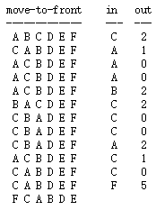
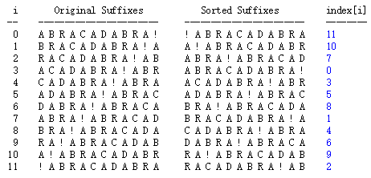
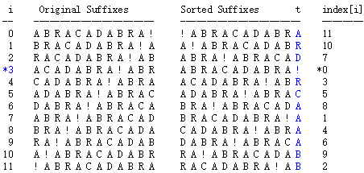
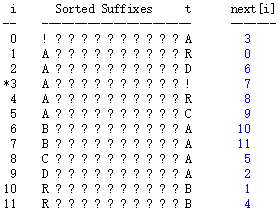
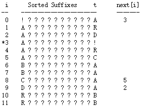

# [Programming Assignment 5: Burrows–Wheeler Data Compression](http://coursera.cs.princeton.edu/algs4/assignments/burrows.html)

## 1. 题目阅读

实现Burrows-Wheeler数据压缩算法。这个革命性的算法产生了gzip和pkzip，并且相对容易实现，还不受任何专利保护。它构成了unix压缩实用程序bzip2的基础。

这个算法由以下三种算法组成：

1. Burrow-Wheeler变换。Given a typical English text file, transform it into a text file in which sequences of the same character occur near each other many times.(Google翻译：给定典型的英文文本文件，将其转换为文本文件，其中相同字符的序列在彼此附近多次出现。)

    这里读英文没读懂，然后去搜索了一下。**这个变换不会改变字符，但是会改变字符串的顺序，它将字符串中相似的字串移动到附近。**在wiki找到个例子，很形象，具体解释往下面继续看。见下表。

    |          |                                              |
    | -------- | -------------------------------------------- |
    | 算法输入 | SIX.MIXED.PIXIES.SIFT.SIXTY.PIXIE.DUST.BOXES |
    | 算法输出 | TEXYDST.E.IXIXIXXSSMPPS.B..E.S.EUSFXDIIOIIIT |

2. Move-to-front编码。给定一个相同字串在附近的文本文件，将其转换为一个出现频率多的字串在前方的文本。
3. Huffman压缩。给定一个出现频率多的字串

第三步是压缩信息的一步，因为第一步和第二步产生了一个某些字母比其他字母出现频繁的文本文件。为了解压这个文件，用相反的顺序操作，第一步，Huffman展开，然后move-to-front解码，最后Burrow-Wheeler逆变换。你的任务就是实现Burrow-Wheeler和move-to-front部分。

### 二进制输输出 
为了让你的程序可以处理二进制数据，你需要使用算法第四版提供的 *BinaryStdIn* 和 *BinaryStdOut*。你可以使用 *HexDump* 在调试时来显示二进制输出。 *HexDump* 接受一个命令行参数n，从标准输入读取字节，并将其写入到16进制，每行k个十六进制数。

### Huffman压缩和解压
使用书上提供的

### Move-to-front编码和解码
move-to-front编码的主要想法是维护一个字符的顺序。重复从输入信息读取字符，打印出这个字符的位置，然后将这个字符移动到序列的前方。作为一个简单的例子，如果初始六个字符的顺序是*A B C D E F*，然后我们希望去编码输入*CAAABCCCACCF*，然后我们需要按照如下方法去更新move-to-front序列。



如果输入中相同的字母出现在相互附近许多次，那么许多输出值将为很小的证书，例如0，1和2。非常高频率的确切字母将是Huffman编码的理想场景。

- Move-to-front编码。你的任务是维护一个包含256个字符的额外ASCII字符串。使用字符在编码中的顺序初始化字符串。然后从输入中每次读取一个8位字符，输出在字符串中的8位索引。当c出现过，就将c移动到字符串前面。
- Move-to-front解码。和编码初始化相同的字符串，然后从输入中每次读取一个八位字符i，将字符串中第i个字符输出，并且移动到前面。IndexPQ

使用下面的api：

<details>

```java
public class MoveToFront {
    // apply move-to-front encoding, reading from standard input and writing to standard output
    public static void encode()

    // apply move-to-front decoding, reading from standard input and writing to standard output
    public static void decode()

    // if args[0] is '-', apply move-to-front encoding
    // if args[0] is '+', apply move-to-front decoding
    public static void main(String[] args)
}
```

</details>

**性能需求** 编码解码时间最差为 *~(nR)*，在实践中为 *~(n + R)*。内存最差为 *~(n + R)*。

### Circular suffix array.
为了有效的实现Burrows-Wheeler变换中的关键部分，你需要使用一个被叫做 *circular suffix array* 的基础数据结构。这个数据结构描述了长度为n的字符串的n个循环后缀的排序数组的抽象。作为例子，我们考虑长度为12的字符串 *"ABRACADABRA!"*。下面的表格显示了他的12循环后缀和排序后的结果。



我们定义了 *index[i]* 表示在排序后的数组中，每一行在原始数组中的位置。例如 *index[11] = 2* ，表示原始数组中第二行后缀出现在了排序后数组的第11行。

实现下面的api，并提供 *index[]*

<details>

```java
public class CircularSuffixArray {
   public CircularSuffixArray(String s)    // circular suffix array of s
   public int length()                     // length of s
   public int index(int i)                 // returns index of ith sorted suffix
   public static void main(String[] args)  // unit testing (required)
}
```

</details>

**边界条件** 参数args为null，index超出索引。抛出异常。

**性能需求** 典型的英语文本，空间 *~(n + R)* 。构造函数 *~(nlogn)* ， *length()* 和 *index()* 常数时间。警告：在java7, Update 6中， *substing()* 方法使用与字串成比例的时间和空间，换句话说，你不能明确的形成一个 *n* 个重复后缀的字符串，因为这样会花费平方时间和空间。**（为什么是平方？？）**

### Burrows–Wheeler变换
Burrows–Wheeler变换的目标不是去压缩信息，而是将信息转换为更适合压缩的形式。变换将输入字符的顺序重新排列为许多有相同字符的集合，但是使用这种变换后的集合依然可以恢复原始输入的顺序。它取决于下面的直觉：当你在英文文本中看到 *hen* 时，它前一个字母最可能为 *t* 或 *w* 。如果你能以某种方式将所有这些前面的字母组合起来，你会有一个简单的数据压缩的机会。

- Burrows-Wheeler变换。对一个长度为n的字符串s的Burrows-Wheeler变换定义如下：

    考虑对s的n个循环后缀进行排序的结果，Burrows-Wheeler变换 *t[]* 是排序后缀的最后一列， *first*是原始字符串在的行。还是上面的例子，如下图。其中 *first = 3*，*t[] = ARD!RCAAAABB*。

    

    注意到里面有4个连续的A，2个连续的B.这些集合将很容易被压缩。

    ```shell
    % java-algs4 BurrowsWheeler - < abra.txt | java-algs4 edu.princeton.cs.algs4.HexDump  16
    00 00 00 03 41 52 44 21 52 43 41 41 41 41 42 42
    128 bits
    ```

    同样，整数3使用4个子节来表示（*00 00 00 03*）。字母 *A* 被表示为hex *41*，字母 *R* 被表示为 *52*，其他的以此类推。

- Burrows-Wheeler逆变换。现在我们来描述如何逆转Burrows-Wheeler变换，并恢复原始的输入字符串。如果 *jth* 原始后缀（将原始字符串向左移动j个字符串）是排序后数组的第 *i* 行，我们定义 *next[i]* 为 *(j + 1)th* 原始后缀在排序后数组的行数。例如，如果 *first* 是原始字符串所在的行，那么 *next[first]* 是 *1st* 原始后缀(将原始字符串向左移动1个字符串)在排序后数组的行数， *next[next[first]]* 是 *2nd* 原始后缀(将原始字符串向左移动2个字符串)在排序后数组的行数，以此类推。
    - 从给定的 *t[]*， *first* 和 *next[]* 数组反推信息。Burrows-Wheeler解码器的输入是排序后的数组的最后一列 *t[]* 和 *first*。从 *t[]* 中我们可以推断出排序后缀数组的第一行，因为它和 *t[]* 有相同的字符，只不过是排序的。

        

        当给出 *next[]* 和 *first* 是，我们可以重构原始输入字符串。因为 *ith* 原始字符串的第一个字符是原始字符串的第 *i* 个字符。在上面的例子中，因为 *first = 3*， 所以我们知道原始字符串在第三行。因此，原始字符串从 *A* 开始，以 *!* 结束。 因为 *next[first] = 7*，下一个原始字符串后缀出现在第七行，因此下一个原始字符串的字符是 *B*。因为 *next[next[first]] = 11*， 下一个原始字符串后缀出现在第11行，因此下一个原始字符串字符是 *R*。

    - 从数组 *t[]* 和 *first* 构造数组 *next[]*。令人惊讶的是，重构这些信息的 *next[]* 包含在Burrows-Wheeler变换里，也就意味着原始信息也包含在其中。对于只出现过一次的字符，推断 *next[]* 是非常容易地。例如，考虑已 *C* 开头的后缀字符串。通过查看第一列，看出它在排列后数组的第8行，排在它后面的下一个后缀字符串将以 *C* 为结尾。通过查看最后一列，原始顺序的下一个后缀字符串在当前数组的第5行，所以 *next[8] = 5*。相似的 *D* 和 *!*也很好得出。

        

        然而，因为 *R* 出现了2次，*next[10] = 1* 和 *next[4] = 4* 或者 *next[10] = 4* 和 *next[4] = 1* 就变得含糊不清。 这里有一个关键的规则来解决模糊性。

        *如果排序过的数组第i行和第j行由同样的字符开始，且 i < j，那么 next[i] < next[j]。*

        这个规则意味着*next[10] = 1* 和 *next[4] = 4*。为什么这个规则有效呢？这些行都是被排序过的，也就意味着第10行比第11行字典顺序小，因此，剩下10个位置的字符构成的字符串，第10行的 也一定小于第11行。我们也知道在由 *R* 结尾的两行中，第1行小于第4行，因此*next[10] = 1* 和 *next[4] = 4*，否则这与后缀排序的事实相矛盾。

实现BurrowsWheeler类，使用以下api：

<details>

```java
public class BurrowsWheeler {
    // apply Burrows-Wheeler transform, reading from standard input and writing to standard output
    public static void transform()

    // apply Burrows-Wheeler inverse transform, reading from standard input and writing to standard output
    public static void inverseTransform()

    // if args[0] is '-', apply Burrows-Wheeler transform
    // if args[0] is '+', apply Burrows-Wheeler inverse transform
    public static void main(String[] args)
}
```

</details>

**性能需求** 变换的最差时间 *~(n + R)*，包括构造循环后缀数组。逆变换时间最差为 *~(n + R)*。内存使用最差 *~(n + R)*。

## 2. 题目分析

这回题目对算法实施细节讲的很细。毕竟这个压缩方法课上也没讲。

具体实现MoveToFront, BurrowsWheeler, CircularSuffixArray这三个类。

### MoveToFront

**编码** 这里需要将字符串中的某一个字符提到第一个，还需要查找某个字符在字符串的第几个位置。维护一个长度为R的字符数组，最开始就按照ascii填充。然后每次从头开始将前一个元素覆盖到后一个元素，直到找到匹配的字符，将此字符放到第一个，然后将上一个填充到此位置。

**解码** 同样维护一个字符数组，覆盖到要寻找的第i个。

### CircularSuffixArray

**构造函数** 根据字符串s的位数n，生成n个后缀循环字符串，并在每个字符串最后加上一个表示左移位数的数，组成一个字符串数组，这个数不会影响字符串的排序，但是可以用来产生index。然后使用MSD对数组进行排序，使用排序后的字符串的最后一位生成index。不用生成t，一是可以通过index生成，二是api没有需求。

长度和index函数返回对应的东西就行。

### BurrowsWheeler

**编码** 使用循环后缀数组，得到index，然后使用index产生 *t[]* ，*t[i] = s* 的第 *index[i] - 1* 位，若 *i = 0*，就是最后一位。同时记录 *index[i] = 0* 的 *i*，这个就是 *first*。

**解码** 将二进制的流转换为 *first* 和 *t[]*。然后使用 *t[]* 去生成 *next[]*。最后使用 *first*， *t[]*， *next[]*来转换为原信息。

发现好像具体压缩的程序不需要自己实现。